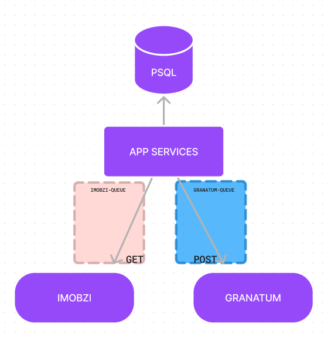

# ImobManager

This application has the function of storing data provided by a third-party API, which currently manages property rental payments for a property management company. After the complete integration between this application and the third-party API, we will create new features based on the data persisted in our own database.

## Workflow



### Third-party APIs

- **Imobzi**: Real State Software, manages payments and contracts/leases
- **Granatum**: Financial software. Here we handle with cash flow, revenues and expenses.

BackEnd infra:

- NestJs
- Prisma ORM
- Postgres
- Docker
- BullMQ (Redis)
- Jwt Auth

Our Entities:

- People
- Organizations
- Buildings
- Properties
- Owners
- Leases
- Leases_items
- Invoices
- Invoices_items

## 3-party APIs

### **ImobziService**: Responsable for consume all data from Imobzi API, processing and formatting this data, and storing it in our database

- Imobzi
  - ImobziContacts \*('**/contacts**' is the endpoit to get info about contacts and organizations on Imobzi)
    - ImobziPeople
    - ImobziOrganizations
  - ImobziProperties
    - ImobziBuildings \* (To get buildings, we need to get on **'/properties'** endpoint)
  - ImobziLeases
  - ImobziInvoices

### **GranatumService** : This service get paid invoices and divide by catgory each item from invoices to store at cash flow

- Granatum
  - GranatumTransactions
  - GranatumAccounts
  - GranatumCategories
  - GranatumCostCenters
  - GranatumClients
  - GranatumSupliers

### How does each service work?

In Application, we have queues:

**QueueImobzi**: Listening POST method at the endpoint '/imobzi/backup' with the body bellow:

```json
// we can choose wich entity we want to update on db.
{
  "contacts": true,
  "buildings": true,
  "properties": true,
  "leases": true,
  "invoices": { "start_due_date": "yyyy/MM/dd" }
}
```

**QueueGranatum**: Listening POST method at the endpoint '/granatum/sync' with the body bellow:

```json
// here we need to send the payment date from invoices to process queue and sync with Granatum's API.

{ "start_at": "2023-08-30", "end_at": "2023-09-29" }
```
